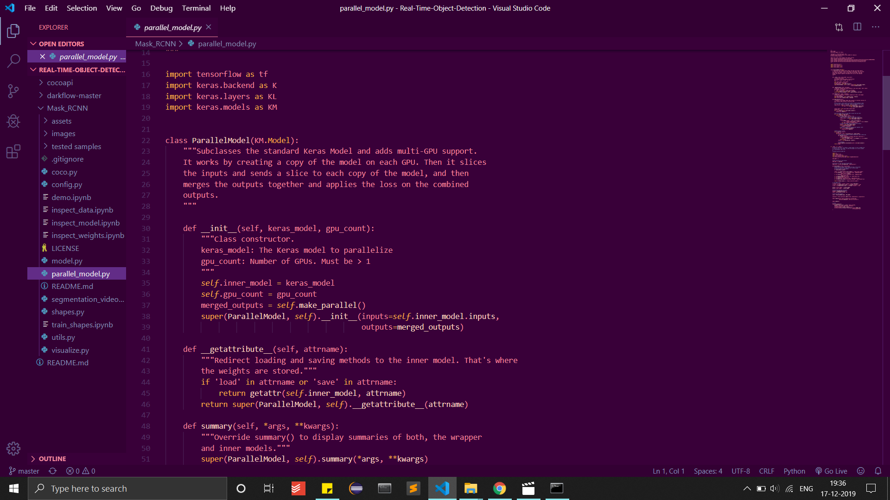

# InstaMuch 
It is a VS code theme inspired by colors in the Instagram logo (shades of purple, pink, orange and peach).

### Edit: InstaMuch is now available as an extension on VSCode. You can get it too! Just follow the steps below.

## Installation via VS Code

1. Open **Extensions** sidebar panel in VS Code. `View → Extensions`
2. Search for `InstaMuch Theme`
3. Click **Install** to install it
4. Click **Reload** to reload the editor
5. Code > Preferences > Color Theme > **InstaMuch Theme**

## Manual Installation

Read the [VSC Extension Quickstart Guide](https://github.com/microsoft/vscode-generator-code/blob/master/generators/app/templates/ext-language/vsc-extension-quickstart.md)

## Theming Reference

[VS Code Theme Color Reference](https://code.visualstudio.com/docs/getstarted/theme-color-reference)

[VS Code Theme Documentation](https://code.visualstudio.com/docs/extensions/themes-snippets-colorizers)

## Screenshots

